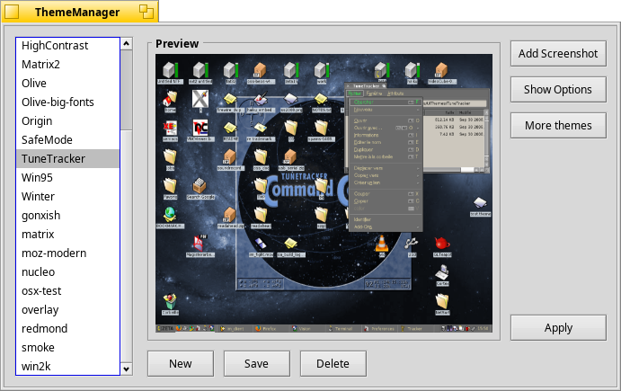

# Haiku Theme Manager

This is the Haiku Theme Manager, compatible with the one shipping with ZETA.
Users can choose which part of the theme to apply or save.
It can also import BeTheme themes, and to some degree, MS Plus themes.
It is add-ons based, so can be extended.

License: MIT

You can help translating this application [here](https://i18n.kacperkasper.pl/projects/26).

This repository contains only the Theme Manager app.
Some themes are available [here](https://github.com/mmuman/HaikuThemes).

## TODO list

* [ ] check R5 build
* [ ] style cleanup (-> Haiku style)
* [ ] enable theme descriptions again (tooltip on listitem ?).
* [ ] make ParseMessage more robust
* [ ] forbid quitting while themes are loading!
* [ ] implement BackupFiles() methods to add required files to a zip.
* [ ] fix TerminalAddon: get theme from haiku
* [ ] Save as resource/BMessage ? (for editing)
* [ ] broadcast _UIC for Haiku
* ideas for addons
  * [ ] ControlLook change support for Haiku
  * [ ] ~/config/settings/Tracker/DefaultFolderTemplate/ (default background ??)
  * [ ] Desktop icon size ?
  * [ ] Desktop shelf ? (dangerous)
  * [ ] Deskbar logo (Be, leaf...)
  * [ ] dircolors (cf. http://linux.die.net/man/5/dir_colors )
  * [ ] icons (/etc/icons ? svg/hvif, setmime...)
  * [ ] Tracker usage bar colors
  * [ ] mouse cursors (needs app_server fixes ??) #8
  * [ ] Pulse colors (-> sample code)
  * [ ] BeIDE/Pe/Eddie full colors (map to singe namespace)
  * [ ] Vision/BeShare full colors (map to singe namespace)
  * [ ] Moe settings #15
  * [ ] Boot Screen customization #7
  * [ ] Firefox theme ?
