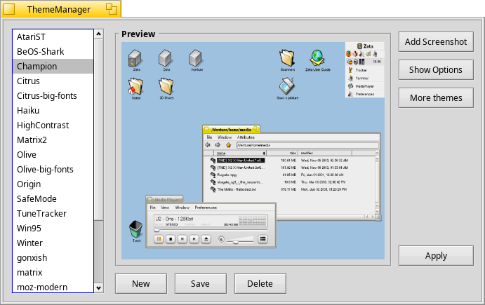
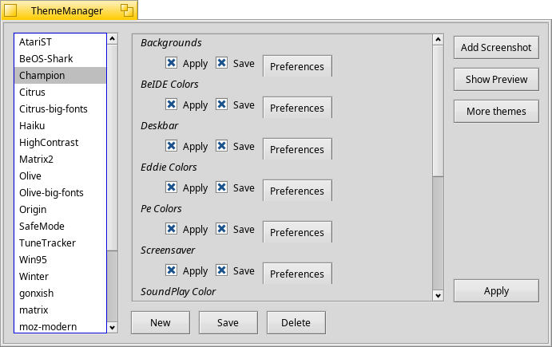

Haiku Theme Manager
=================

 

**NOTE**: Branch "master" contains only the Theme Manager app. Themes reside in "themes" branch. [Download themes](https://github.com/HaikuArchives/HaikuThemeManager/archive/themes.zip).

This is the Haiku Theme Manager, compatible with the one shipping with ZETA.
Users can choose which part of the theme to apply or save.
It can also import BeTheme themes, and to some degree, MS Plus themes.
It is add-ons based, so can be extended.

License: MIT
